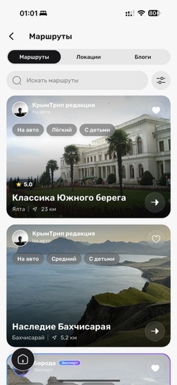
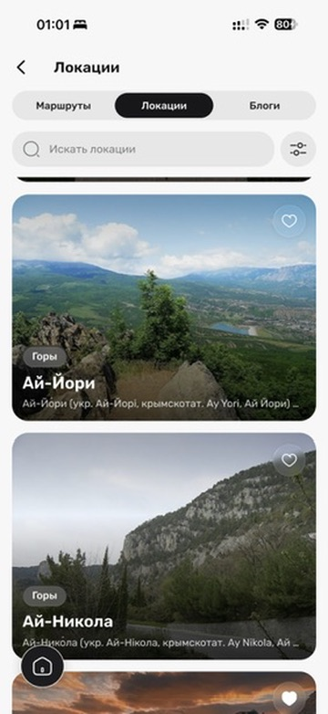
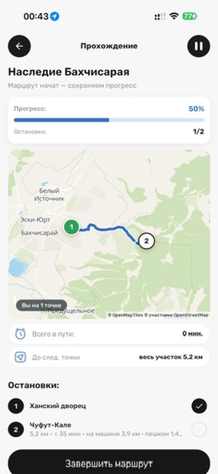

# КРЫМТРИП · Crimea Travel Platform

Мобильное приложение и платформа для планирования поездок по Крыму: каталог мест
и статей, готовые и сгенерированные маршруты, прохождение с картой и офлайн-снимком.

Проект не является официальным государственным приложением и не заявляет об
официальном партнёрстве с государственными организациями.

<!-- MEDIA:HERO -->

<p align="center">
  
  
</p>

---

## Зачем это нужно

Информация о туристических местах Крыма разбросана и быстро устаревает: режим работы,
сезонные ограничения, состояние троп, где вход и есть ли он вообще. У природных
и горных локаций часто нет ни точного адреса, ни одного входа — их несколько,
и с разных сторон. Плюс в горах пропадает связь ровно тогда, когда маршрут нужнее всего.

Собрать из этого выполнимый маршрут — с учётом того, сколько у тебя времени, едешь ли
ты на машине, есть ли с тобой дети — руками тяжело. КРЫМТРИП делает это за вас
и, что важнее, **показывает, почему предложил именно это**.

## Что умеет

### Каталог мест и маршрутов

В каталоге отдельно собраны маршруты и локации: их можно искать, фильтровать
и добавлять в избранное. Карточки маршрутов показывают транспорт, сложность,
расстояние и оценку; карточки локаций — название, категорию и фотографию.

<!-- MEDIA:CATALOG -->

<p align="center">
  
  
</p>

### Три способа получить маршрут

| Способ | Как работает | Кому |
| --- | --- | --- |
| **Готовые маршруты** | Просмотр каталога и фильтры по теме | Хочу выбрать сам |
| **Подбор по параметрам** | Город, тип поездки, длительность, состав группы и интересы | Знаю, чего хочу |
| **Тревел Агент (ИИ)** | Диалог на русском: варианты маршрутов и уточнение пожеланий | Хочу обсудить поездку |

<!-- MEDIA:MATCH -->

<p align="center">
  
  
</p>

### Прохождение маршрута

Во время прогулки видны линия маршрута, пройденные остановки и следующий
участок. Прохождение можно поставить на паузу или завершить; в истории
сохраняются завершённые и приостановленные маршруты.

<!-- MEDIA:EXECUTION -->

<p align="center">
  
  
</p>

### Профиль и социальное

Профиль показывает звание и статистику поездок. На отдельном экране достижений
виден прогресс по каждой цели и уже полученные награды. Также доступны
избранное, отзывы, рейтинг путешественников и публикация своих маршрутов.

<!-- MEDIA:PROFILE -->

<p align="center">
  
  
</p>

---

## Чем отличается

**Маршрут объясняет сам себя.** Подбор возвращает не только результат, но и причины:
«старт рядом с Ялтой», «длительность совпадает», «интересы: горы, фото». Пользователь
видит логику, а не чёрный ящик.

**Данные важнее полноты.** Принцип проекта: лучше меньше мест, но с проверенным
расписанием и предупреждениями, чем большой каталог, которому нельзя доверять.
Источник и свежесть критичных данных видны и проверяемы.

**Данные доступны без связи.** Сохранённый снимок маршрута можно просматривать
офлайн; пошаговую навигацию с поворотами продукт пока не обещает.

**Сменные провайдеры.** Роутинг, ИИ и геоданные подключены через контракты
(`RoutingProvider`, `AIPlanningProvider`, `TspProvider`, `DistanceMatrixProvider`),
у каждого есть заглушка. Смена поставщика — это конфиг, а не переписывание.
ИИ переключается между локальной моделью и облачной прямо из админки, без редеплоя.

**Не привязан к Крыму.** Модель `Country → Region → Locality → Place` рассчитана
на несколько регионов; Крым — первый контур, а не единственный возможный.

---

## Как устроено

Git superproject с четырьмя submodule:

```text
workspace/
├── docs/                 # индекс документации
├── tourism-platform/     # docs, Compose, deploy
├── tourism-backend/      # FastAPI modular monolith
├── tourism-mobile/       # Flutter app
└── tourism-landing/      # публичный сайт
```

| Repository | Назначение |
| --- | --- |
| [`tourism-platform`](https://github.com/xotabeach/tourism-platform) | Docs, local Compose, test deploy |
| [`tourism-backend`](https://github.com/xotabeach/tourism-backend) | Python 3.13 / FastAPI modular monolith |
| [`tourism-mobile`](https://github.com/xotabeach/tourism-mobile) | Flutter Android / iOS |
| [`tourism-landing`](https://github.com/xotabeach/tourism-landing) | Публичный сайт и загрузка APK |

**Мобильное:** Flutter, Riverpod, GoRouter, Dio.
**Бэкенд:** Python 3.13, FastAPI, Pydantic v2, SQLAlchemy 2, Alembic.
**Данные:** PostgreSQL + PostGIS (+ pgvector), Redis.
**Инфраструктура:** Docker Compose, Caddy.
**ИИ:** сменный `AIPlanningProvider` — mock / Gemini / LM Studio (Gemma 4 26B).

Модули бэкенда: `identity`, `geography`, `places`, `routes`, `favorites`, `support`,
`notifications`, `admin`, `media`, `route_builder`, `route_execution`, `subscriptions`,
`recommendations`, `knowledge`, `content`, `runtime_config`.

Подробнее: [стек](https://github.com/xotabeach/tourism-platform/blob/main/docs/stack.md) ·
[доменная модель](https://github.com/xotabeach/tourism-platform/blob/main/docs/domain-model.md) ·
[архитектурные решения](https://github.com/xotabeach/tourism-platform/blob/main/docs/decisions)

---

## Статус

В коде реализованы каталог, авторизация, статьи и комментарии, публикация
маршрутов, профиль, отзывы, уведомления, прохождение и история маршрутов,
подбор и ИИ-чат. Маршруты содержат дни, этапы и оценку сложности. Админка
включает адаптивные рабочие экраны, дашборд, очереди поддержки и настраиваемые
права ролей и сотрудников. Публичный сайт ведёт на загрузку опубликованного APK.

Оплата Travel+, аудиогид и пошаговая навигация пока не подключены как
полноценные сценарии. Версия исходного мобильного кода может отличаться от
опубликованного APK. Подробный срез:
[текущий статус](https://github.com/xotabeach/tourism-platform/blob/main/docs/current-status.md).

---

## Документация

Канон — в `tourism-platform/docs/`. Индекс: [docs/README.md](docs/README.md).

- [Видение продукта](https://github.com/xotabeach/tourism-platform/blob/main/docs/product-vision.md)
- [Бизнес-логика](https://github.com/xotabeach/tourism-platform/blob/main/docs/application-business-logic.md)
- [Доменная модель](https://github.com/xotabeach/tourism-platform/blob/main/docs/domain-model.md)
- [Стек](https://github.com/xotabeach/tourism-platform/blob/main/docs/stack.md)
- [Текущий статус](https://github.com/xotabeach/tourism-platform/blob/main/docs/current-status.md)
- [Архитектурные решения (ADR)](https://github.com/xotabeach/tourism-platform/blob/main/docs/decisions)
- [Локальная разработка](https://github.com/xotabeach/tourism-platform/blob/main/docs/local-development.md)
- [Соглашения разработки](https://github.com/xotabeach/tourism-platform/blob/main/docs/development-conventions.md)

---

## Видимость

Источник истины — GitLab (`gitlab.com/travel-platform2/`), GitHub — публичное зеркало.
