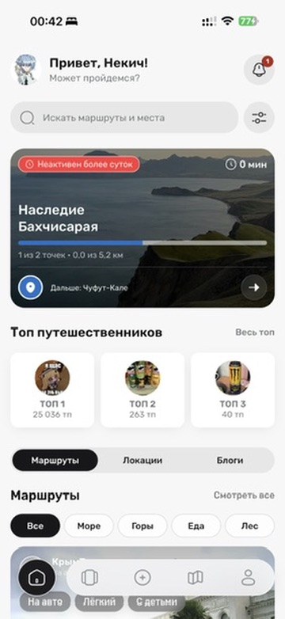
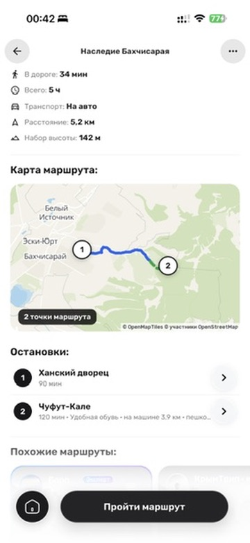
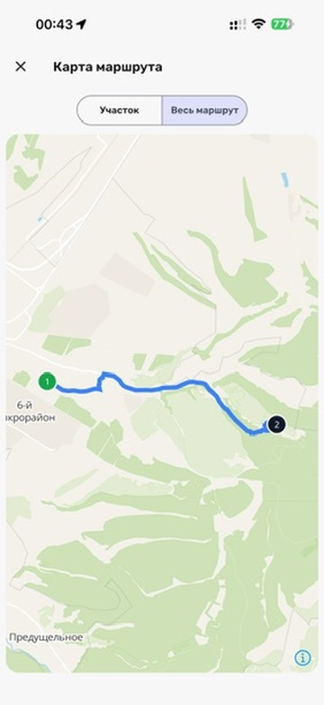
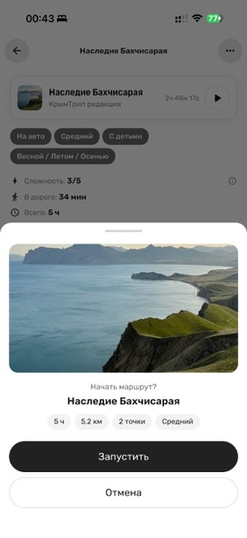
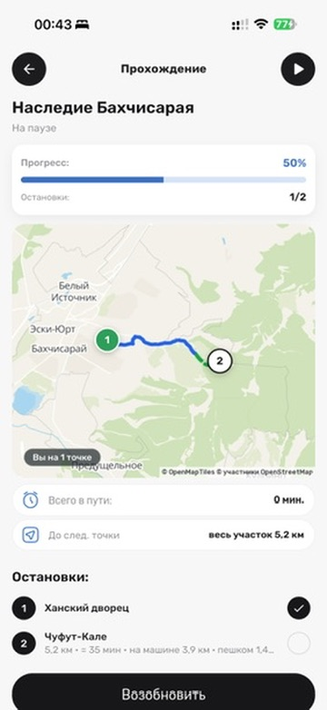

# КРЫМТРИП · Crimea Travel Platform

Мобильное приложение и платформа для планирования поездок по Крыму: каталог мест
и статей, готовые и сгенерированные маршруты, прохождение с картой и офлайн-снимком.

Проект не является официальным государственным приложением и не заявляет об
официальном партнёрстве с государственными организациями.

<!-- MEDIA:HERO -->

<p align="center">
  
  
</p>

---

## Зачем это нужно

Информация о туристических местах Крыма разбросана и быстро устаревает: режим работы,
сезонные ограничения, состояние троп, где вход и есть ли он вообще. У природных
и горных локаций часто нет ни точного адреса, ни одного входа — их несколько,
и с разных сторон. Плюс в горах пропадает связь ровно тогда, когда маршрут нужнее всего.

Собрать из этого выполнимый маршрут — с учётом того, сколько у тебя времени, едешь ли
ты на машине, есть ли с тобой дети — руками тяжело. КРЫМТРИП делает это за вас
и, что важнее, **показывает, почему предложил именно это**.

## Что умеет

### Каталог и маршруты

Места с категориями, сезонностью, расписанием, несколькими входами и предупреждениями
о безопасности. Данные — PostGIS, поэтому «рядом» — это настоящая география,
а не совпадение по названию. В каталоге маршруты можно искать и фильтровать
по тематике; карточка показывает транспорт, сложность и длительность.

<!-- MEDIA:CATALOG -->

<p align="center">
  
</p>

### Три способа получить маршрут

| Способ | Как работает | Кому |
| --- | --- | --- |
| **Готовые маршруты** | Редакционные и пользовательские, прошедшие модерацию | Хочу быстро |
| **Подбор по параметрам** | Форма: город, время, интересы, темп, транспорт → детерминированный скоринг каталога | Знаю, чего хочу |
| **Тревел Агент (ИИ)** | Диалог на русском, уточняющие вопросы, генерация маршрута под ответы | Не знаю, с чего начать |

<!-- MEDIA:MATCH -->

<p align="center">
  
  
</p>

### Прохождение маршрута

Прохождение с картой, отметкой точек, активным маршрутом, историей и офлайн-снимком.
Маршрут фиксируется снапшотом на старте — то есть отчёт о прохождении нельзя
«подкрутить» задним числом, отредактировав маршрут.

<!-- MEDIA:EXECUTION -->

<p align="center">
  
  
  
</p>

<p align="center">
  
  
  
</p>

### Профиль и социальное

Звания за пройденные маршруты, достижения, статистика, лидерборд, отзывы с фото,
избранное, публикация своих маршрутов с модерацией.

<!-- MEDIA:PROFILE -->

<p align="center">
  
  
</p>

---

## Чем отличается

**Маршрут объясняет сам себя.** Подбор возвращает не только результат, но и причины:
«старт рядом с Ялтой», «длительность совпадает», «интересы: горы, фото». Пользователь
видит логику, а не чёрный ящик.

**Данные важнее полноты.** Принцип проекта: лучше меньше мест, но с проверенным
расписанием и предупреждениями, чем большой каталог, которому нельзя доверять.
Источник и свежесть критичных данных видны и проверяемы.

**Данные доступны без связи.** Сохранённый снимок маршрута можно просматривать
офлайн; пошаговую навигацию с поворотами продукт пока не обещает.

**Сменные провайдеры.** Роутинг, ИИ и геоданные подключены через контракты
(`RoutingProvider`, `AIPlanningProvider`, `TspProvider`, `DistanceMatrixProvider`),
у каждого есть заглушка. Смена поставщика — это конфиг, а не переписывание.
ИИ переключается между локальной моделью и облачной прямо из админки, без редеплоя.

**Не привязан к Крыму.** Модель `Country → Region → Locality → Place` рассчитана
на несколько регионов; Крым — первый контур, а не единственный возможный.

---

## Как устроено

Git superproject с четырьмя submodule:

```text
workspace/
├── docs/                 # индекс документации
├── tourism-platform/     # docs, Compose, deploy
├── tourism-backend/      # FastAPI modular monolith
├── tourism-mobile/       # Flutter app
└── tourism-landing/      # публичный сайт
```

| Repository | Назначение |
| --- | --- |
| [`tourism-platform`](tourism-platform) | Docs, local Compose, test deploy |
| [`tourism-backend`](tourism-backend) | Python 3.13 / FastAPI modular monolith |
| [`tourism-mobile`](tourism-mobile) | Flutter Android / iOS |
| [`tourism-landing`](tourism-landing) | Публичный сайт и загрузка APK |

**Мобильное:** Flutter, Riverpod, GoRouter, Dio.
**Бэкенд:** Python 3.13, FastAPI, Pydantic v2, SQLAlchemy 2, Alembic.
**Данные:** PostgreSQL + PostGIS (+ pgvector), Redis.
**Инфраструктура:** Docker Compose, Caddy.
**ИИ:** сменный `AIPlanningProvider` — mock / Gemini / LM Studio (Gemma 4 26B).

Модули бэкенда: `identity`, `geography`, `places`, `routes`, `favorites`, `support`,
`notifications`, `admin`, `media`, `route_builder`, `route_execution`, `subscriptions`,
`recommendations`, `knowledge`, `content`, `runtime_config`.

Подробнее: [стек](tourism-platform/docs/stack.md) ·
[доменная модель](tourism-platform/docs/domain-model.md) ·
[архитектурные решения](tourism-platform/docs/decisions)

---

## Статус

В коде реализованы каталог, авторизация, статьи и комментарии, публикация
маршрутов, профиль, отзывы, уведомления, прохождение и история маршрутов,
подбор и ИИ-чат. Маршруты содержат дни, этапы и оценку сложности. Админка
включает адаптивные рабочие экраны, дашборд, очереди поддержки и настраиваемые
права ролей и сотрудников. Публичный сайт ведёт на загрузку опубликованного APK.

Оплата Travel+, аудиогид и пошаговая навигация пока не подключены как
полноценные сценарии. Версия исходного мобильного кода может отличаться от
опубликованного APK. Подробный срез:
[текущий статус](tourism-platform/docs/current-status.md).

---

## Документация

Канон — в `tourism-platform/docs/`. Индекс: [docs/README.md](docs/README.md).

- [Видение продукта](tourism-platform/docs/product-vision.md)
- [Бизнес-логика](tourism-platform/docs/application-business-logic.md)
- [Доменная модель](tourism-platform/docs/domain-model.md)
- [Стек](tourism-platform/docs/stack.md)
- [Текущий статус](tourism-platform/docs/current-status.md)
- [Архитектурные решения (ADR)](tourism-platform/docs/decisions)
- [Локальная разработка](tourism-platform/docs/local-development.md)
- [Соглашения разработки](tourism-platform/docs/development-conventions.md)

---

## Видимость

Источник истины — GitLab (`gitlab.com/travel-platform2/`), GitHub — публичное зеркало.
